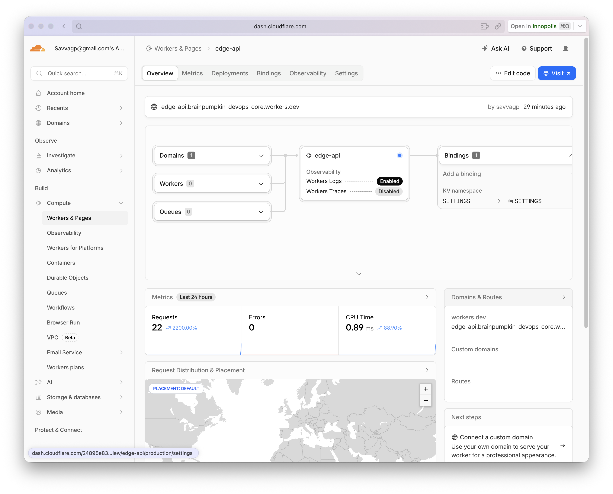
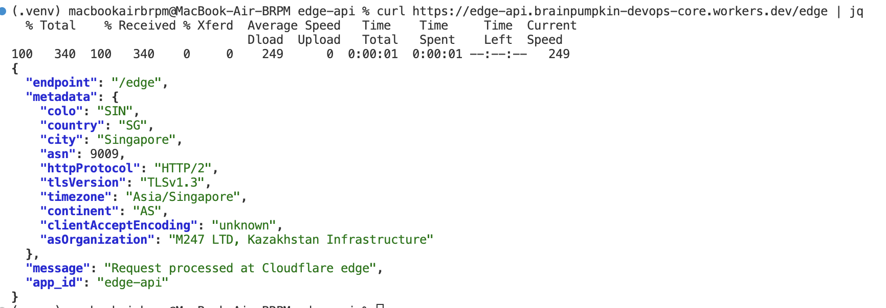
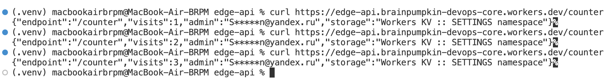
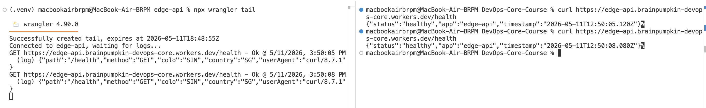
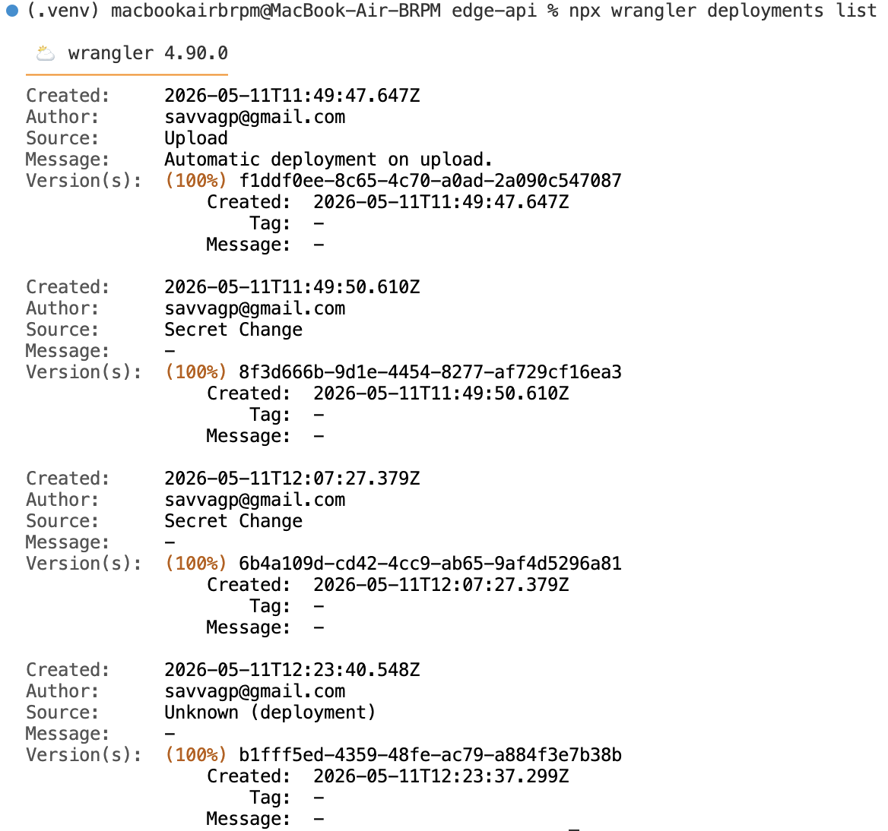
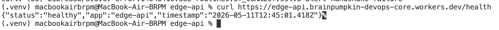

# Cloudflare Workers Edge Deployment Report

## Lab 17 — Edge Computing with Cloudflare Workers

---

## 1. Deployment Summary

### Worker Info

| Field | Value |
|-------|-------|
| **Worker Name** | `edge-api` |
| **Deployed URL** | `https://edge-api.brainpumpkin-devops-core.workers.dev` |
| **Runtime** | Cloudflare Workers (V8 isolates) |
| **Language** | TypeScript |
| **Project Path** | `edge-api/` |

### Routes

| Path | Method | Description | State |
|------|--------|-------------|-------|
| `/` | GET | App info, version, endpoints list | Stateless |
| `/health` | GET | Health check with timestamp | Stateless |
| `/edge` | GET | Edge metadata (colo, country, city, ASN, etc.) | Stateless |
| `/counter` | GET | KV-backed persisted visit counter | Persistent (KV) |
| `/config` | GET | Configuration status (secrets presence) | Stateless |

### Configuration

| Type | Key | Source | Status |
|------|-----|--------|--------|
| Plaintext var | `APP_NAME` | `wrangler.jsonc` vars | `edge-api` |
| Plaintext var | `COURSE_NAME` | `wrangler.jsonc` vars | `devops-core` |
| Secret | `API_TOKEN` | `wrangler secret put` | Configured |
| Secret | `ADMIN_EMAIL` | `wrangler secret put` | Configured |
| KV Namespace | `SETTINGS` | `wrangler kv namespace create` | Bound |

---

## 2. Project Structure

```
edge-api/
├── .gitignore
├── package.json
├── tsconfig.json
├── wrangler.jsonc          # Worker config: vars, KV binding, compat flags
└── src/
    └── index.ts            # Main Worker handler (all routes)
```

### wrangler.jsonc

```jsonc
{
  "name": "edge-api",
  "main": "src/index.ts",
  "compatibility_date": "2025-05-11",
  "compatibility_flags": ["nodejs_compat"],
  "vars": {
    "APP_NAME": "edge-api",
    "COURSE_NAME": "devops-core"
  },
  "kv_namespaces": [
    {
      "binding": "SETTINGS",
      "id": "fcf0153be41240dd97981a42674e717f"
    }
  ],
  "observability": {
    "enabled": true
  }
}
```

---

## 3. Implementation Details

### 3.1 `/` — App Information

Returns service metadata, version, and available endpoints. Uses `APP_NAME` and `COURSE_NAME` environment variables.

### 3.2 `/health` — Health Check

Returns `{"status": "healthy", "app": "...", "timestamp": "..."}`. Lightweight endpoint for uptime monitoring and external health checks.

### 3.3 `/edge` — Edge Metadata

Leverages Cloudflare's `request.cf` object to return real-time request metadata. Unlike traditional server deployments, Workers runs on Cloudflare's global network — every request already carries this data without additional infrastructure. Exposes:

- `colo` — data center code (e.g., `ARN`, `FRA`, `SIN`)
- `country` — country code of the client (e.g., `DE`, `JP`)
- `city` — client city
- `asn` — autonomous system number
- `httpProtocol` — HTTP version of the request
- `tlsVersion` — TLS version negotiated
- `timezone` — client timezone
- `continent` — client continent

### 3.4 `/counter` — KV-Backed Counter

Demonstrates persistent state via Workers KV. Reads an existing `visits` key, increments it, writes back, and returns the new value. KV is eventually consistent — writes are globally replicated within 60 seconds.

### 3.5 Console Logging

Structured JSON logging via `console.log()`. Each request logs path, method, colo, country, and user-agent. Logs are viewable via:
- `npx wrangler tail` (streaming, last ~30 min)
- Cloudflare Dashboard → Workers & Pages → edge-api → Logs

---

## 4. Global Distribution

### How Workers Distributes Execution Globally

Cloudflare Workers runs on a global network of 330+ data centers. When you deploy a Worker:

1. Your code is uploaded to Cloudflare.
2. Cloudflare distributes it to **every data center** automatically.
3. When a request arrives at any Cloudflare edge location, the Worker executes there — as close to the user as possible.
4. No "choose a region" step exists. Every deployment is instantly global.

### Comparison with Traditional VM/PaaS Regional Deployment

| Aspect | Cloudflare Workers | VMs / PaaS (AWS, GCP, etc.) |
|--------|-------------------|-----------------------------|
| **Region selection** | None — automatic global | Manual (us-east-1, eu-west-1, etc.) |
| **Deploy to multiple regions** | Instant, all at once | Deploy separately per region |
| **Latency for distant users** | Minimal (nearest edge) | High if user is far from region |
| **Capacity planning** | Automatic | Manual (instance size, autoscaling) |
| **Cold starts** | Sub-millisecond (V8 isolates) | Seconds (container/VM boot) |
| **Cost for global distribution** | No extra cost | Pay per region |

### routing: workers.dev vs Routes vs Custom Domains

| Method | Description | When to Use |
|--------|-------------|-------------|
| **`workers.dev`** | Free `*.workers.dev` subdomain, public URL immediately | Development, testing, demos |
| **Routes** | Attach Worker to specific URL patterns on your Cloudflare zone | Production, existing domains on Cloudflare |
| **Custom Domains** | Point a domain/subdomain directly at a Worker | Standalone services, API endpoints |

---

## 5. Secrets & Environment Variables

### Plaintext Variables vs Secrets

| Type | Storage | Visibility | Use Case |
|------|---------|------------|----------|
| `vars` (plaintext) | `wrangler.jsonc`, committed to Git | Visible in source/Dashboard UI | Non-sensitive config: app name, feature flags, version |
| Secrets | Encrypted, never in source/Dashboard UI | Hidden, audit log only | API keys, tokens, passwords, emails |

**Secrets created:**
```bash
npx wrangler secret put API_TOKEN
npx wrangler secret put ADMIN_EMAIL
```

Secrets are accessed through the `env` object at runtime, identical to plaintext vars. The difference is purely in how they're stored and managed.

---

## 6. Evidence

### 6.1 Cloudflare Dashboard



### 6.2 Deployed Worker — `/edge` Response



### 6.3 KV Counter Persistence



### 6.4 Logs / Tail



### 6.5 Deployment History



### 6.6 Health Endpoint



---

## 7. Kubernetes vs Cloudflare Workers Comparison

| Aspect | Kubernetes | Cloudflare Workers |
|--------|------------|--------------------|
| **Setup complexity** | High — cluster provisioning, networking, RBAC, storage classes, Helm charts | Low — `npx create cloudflare`, `wrangler deploy` |
| **Deployment speed** | Minutes (image build + pod rollout) | Seconds (upload script to edge) |
| **Global distribution** | Manual — deploy per region, use CDN/load balancer | Automatic — 330+ data centers instantly |
| **Cost (for small apps)** | $30-70+/mo for managed cluster, or ops overhead for self-managed | Free tier: 100k req/day, 10ms CPU/req |
| **State/persistence model** | Full: PVs, PVCs, StatefulSets, external DBs | KV (eventually consistent), D1 (SQLite), R2 (object storage), Durable Objects |
| **Control/flexibility** | Full control: any language, any container, custom networking, sidecars | V8 isolates or WebAssembly only; limited runtime API |
| **Best use case** | Complex microservices, databases, long-running containers, batch jobs, GPU workloads | Globally distributed APIs, edge middleware, A/B testing, lightweight serverless |

### When to Use Each

**Favor Kubernetes when:**
- You need long-running processes, background workers, or persistent connections
- You run a database or stateful workload requiring filesystem access
- You need fine-grained control over networking, service mesh, or custom schedulers
- Your app requires specific OS-level dependencies or binaries
- You operate in a regulated environment requiring full infrastructure control

**Favor Cloudflare Workers when:**
- Your app is a lightweight HTTP API or webhook handler
- Global low-latency is critical and you don't want to manage regions
- You need zero-maintenance autoscaling to zero or thousands of RPS
- You want to iterate fast — write, deploy, use, no infrastructure to maintain
- Your team has limited ops bandwidth and wants managed serverless

### Reflection

**What felt easier than Kubernetes?**
Deployment is a single command (`wrangler deploy`). No pod scheduling, no Helm chart templating, no image registries, no networking configuration. The iteration loop from code change to public URL is seconds rather than minutes.

**What felt more constrained?**
The Workers runtime is not a full OS. No Dockerfile — you can't install arbitrary packages or native binaries. State is limited to KV/D1/Durable Objects — no persistent filesystem, no direct DB connections over TCP. The V8 isolate model means bundled startup, not container lifecycle.

**What changed because Workers is not a Docker host?**
Instead of building a Docker image and running containers, you write a single TypeScript function that handles HTTP requests. Configuration lives in `wrangler.jsonc` (not Helm values), secrets are managed via CLI (not Kubernetes Secrets), and persistence is via Cloudflare platform bindings (not PVCs). The mental model shifts from "manage a fleet of containers" to "deploy a function to the edge."

---

## 8. Setup Commands

| Step | Command |
|------|---------|
| Install dependencies | `npm install` |
| Authenticate | `npx wrangler login` |
| Verify auth | `npx wrangler whoami` |
| Dev server | `npx wrangler dev` |
| Create KV namespace | `npx wrangler kv namespace create SETTINGS` |
| Bind KV (after getting ID) | Update `wrangler.jsonc` → `kv_namespaces[0].id` |
| Set secrets | `npx wrangler secret put API_TOKEN` |
| | `npx wrangler secret put ADMIN_EMAIL` |
| Deploy | `npx wrangler deploy` |
| View logs | `npx wrangler tail` |
| List deployments | `npx wrangler deployments list` |
| Rollback | `npx wrangler rollback` |
| Test endpoints | `curl https://edge-api.brainpumpkin-devops-core.workers.dev/health` |

---

## 9. Files Created

| File | Purpose |
|------|---------|
| `edge-api/package.json` | Project metadata, scripts, dependencies |
| `edge-api/tsconfig.json` | TypeScript configuration |
| `edge-api/wrangler.jsonc` | Worker configuration (vars, KV, compatibility) |
| `edge-api/.gitignore` | Ignore node_modules, dist, .wrangler |
| `edge-api/src/index.ts` | Worker handler — all routes |
| `WORKERS.md` | This report |

