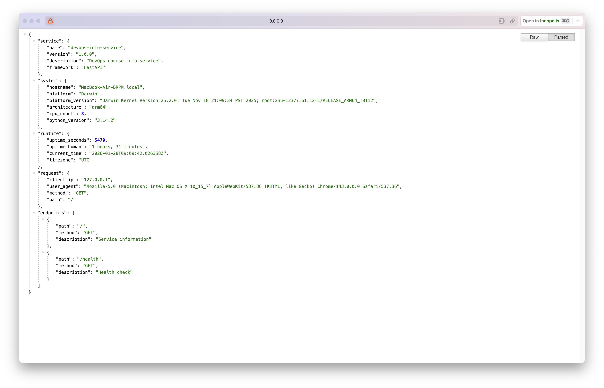
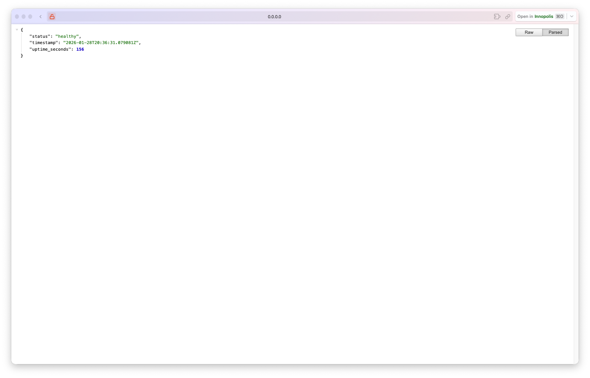
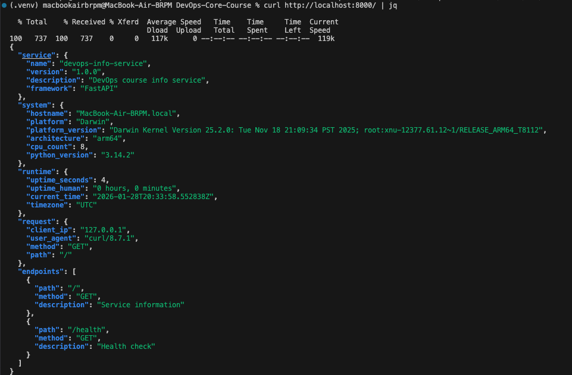

# Lab 01 - DevOps Info Service

**Student:** Savva Ponomarev

**Mail:** s.ponomarev@innopolis.university

**Date:** January 28, 2026  

**Framework:** FastAPI

---

## 1. Framework Selection

I chose **FastAPI** over Flask and Django for the following reasons:

### Why FastAPI?

1. **Automatic API Documentation** - FastAPI automatically generates interactive API docs at `/docs` (Swagger UI) and `/redoc`. This is perfect for a DevOps service where documentation is critical.

2. **Modern Python Features** - FastAPI uses Python type hints and Pydantic for automatic data validation. This catches errors early and makes code more maintainable.

3. **Asynchronous Support** - Built on ASGI with native `async/await` support, making it faster than Flask for I/O-bound operations.

4. **Performance** - FastAPI is one of the fastest Python frameworks, comparable to Node.js and Go in benchmarks.

5. **Future-Ready** - This service will evolve throughout the course. FastAPI's built-in validation and serialization will be useful when adding Prometheus metrics (Lab 8) and database persistence (Lab 12).

---

## 2. Best Practices Applied

### 2.1 Clean Code Organization

The application follows a clear structure with logical grouping:

```python
# 1. Imports (grouped: standard library, third-party)
import os
import time
from fastapi import FastAPI

# 2. Configuration
START_TIME = time.time()

# 3. Helper functions
def get_uptime_data():
    ...

# 4. Route handlers
@app.get("/")
async def root():
    ...
```

**Why it matters:** Organized code is easier to maintain, debug, and extend.

2.2 Error Handling

Implemented custom error handlers for common HTTP errors:

```python
@app.exception_handler(404)
async def not_found_handler(request: Request, exc):
    return JSONResponse(
        status_code=404,
        content={"error": "Not Found", "message": "Endpoint does not exist"}
    )
```
**Why it matters:** Graceful error handling improves user experience and makes debugging easier.

2.3 Logging

Configured structured logging throughout the application:

```python
logging.basicConfig(
    level=logging.INFO,
    format='%(asctime)s - %(name)s - %(levelname)s - %(message)s'
)
logger = logging.getLogger("devops-info-service")
```
**Why it matters:** Logs help monitor application behavior in production and troubleshoot issues.

2.4 Environment-Based Configuration

Used environment variables for flexible deployment:
```python
port = int(os.getenv("PORT", 8000))
host = os.getenv("HOST", "0.0.0.0")
```

2.5 PEP 8 Compliance

Followed Python style guidelines:

- 4 spaces for indentation
- Snake_case for functions and variables
- Descriptive function and variable names
- Docstrings for all functions

**Why it matters:** Consistent style improves code readability and team collaboration.

2.6 Dependency Management
Pinned exact versions in ```requirements.txt```:
```
fastapi==0.115.0
uvicorn[standard]==0.32.0
```
**Why it matters:** Ensures reproducible builds and prevents unexpected behavior from dependency updates.

## 3. API Documentation
**Endpoint: GET /**

**Description:** Returns comprehensive service, system, runtime, and request information.

### Request Example:

```bash
curl http://localhost:8000/
```
### Response (200 OK):

```json
{
  "service": {
    "name": "devops-info-service",
    "version": "1.0.0",
    "description": "DevOps course info service",
    "framework": "FastAPI"
  },
  "system": {
    "hostname": "savva-laptop",
    "platform": "Linux",
    "platform_version": "#1 SMP...",
    "architecture": "x86_64",
    "cpu_count": 8,
    "python_version": "3.13.1"
  },
  "runtime": {
    "uptime_seconds": 120,
    "uptime_human": "0 hours, 2 minutes, 0 seconds",
    "current_time": "2026-01-28T07:16:00.000Z",
    "timezone": "UTC"
  },
  "request": {
    "client_ip": "127.0.0.1",
    "user_agent": "curl/7.81.0",
    "method": "GET",
    "path": "/"
  },
  "endpoints": [
    {"path": "/", "method": "GET", "description": "Service information"},
    {"path": "/health", "method": "GET", "description": "Health check"}
  ]
}
```
**Endpoint: GET /health**

**Description:** Health check endpoint for monitoring and Kubernetes probes.

### Request Example:

```bash
curl http://localhost:8000/health
```
### Response (200 OK):
```json
{
  "status": "healthy",
  "timestamp": "2026-01-28T07:16:00.000Z",
  "uptime_seconds": 120
}
```

## 4. Testing Evidence



The main / endpoint returning complete JSON response with all required fields (service, system, runtime, request, endpoints)



The /health endpoint returning health status with timestamp and uptime



curl | jq command

## 5. Challenges & Solutions

No significant challenges were encountered during implementation. The provided hints in the assignment and FastAPI documentation were sufficient to complete all requirements.

The ```.gitignore``` file I've made via this [site](https://www.toptal.com/developers/gitignore)

## 6. GitHub Community
**Why Starring Repositories Matters**

Starring repositories on GitHub serves multiple purposes in open source development. It acts as a bookmark system, allowing developers to save interesting projects for future reference. More importantly, stars signal appreciation to maintainers and indicate project quality to the community. High star counts help projects gain visibility in GitHub's search and recommendation algorithms, which is crucial for open source adoption.

**How Following Developers Helps**

Following developers on GitHub creates valuable professional connections beyond the classroom. It enables continuous learning by exposing you to real-world code practices and problem-solving approaches from experienced developers. In team projects, following teammates makes collaboration easier by keeping everyone updated on each other's work. This practice also builds a supportive learning community and increases professional visibility in the developer ecosystem.


Actions Completed

✅ Starred the course repository

✅ Starred simple-container-com/api

✅ Followed professor @Cre-eD

✅ Followed TA @marat-biriushev

✅ Followed TA @pierrepicaud

✅ Followed 3+ classmates