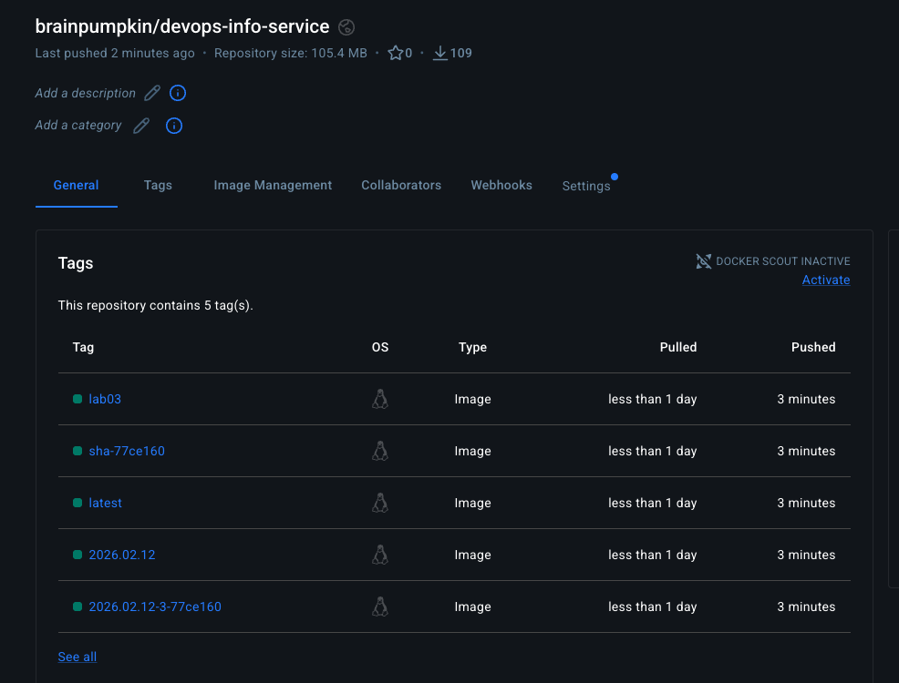

# Lab 3 — Continuous Integration (CI/CD)

## Task 1 — Unit Testing

### Testing Framework: pytest
I chose **pytest** because:
- Simple syntax with `assert` statements
- Powerful fixtures for test setup
- Excellent integration with FastAPI (TestClient)
- Coverage reporting with pytest-cov

### Test Structure

```
app_python/tests/
├── init.py # Makes tests a Python package
└── test_app.py # All test cases
├── TestRootEndpoint # 7 tests for GET /
│ ├── test_root_status_code
│ ├── test_root_response_structure
│ ├── test_service_info
│ ├── test_system_info
│ ├── test_runtime_info
│ ├── test_request_info
│ └── test_endpoints_listing
│
├── TestHealthEndpoint # 4 tests for GET /health
│ ├── test_health_status_code
│ ├── test_health_response_structure
│ ├── test_health_status_value
│ └── test_health_timestamp_format
│
├── TestErrorHandling # 2 tests for error cases
│ ├── test_404_not_found
│ └── test_invalid_method
│
└── TestUptimeCalculation # 2 tests for uptime logic
├── test_uptime_consistency
└── test_uptime_human_format
```


### What's Tested
- Root endpoint - JSON structure, required fields, data types
-  Health endpoint - status, timestamp, uptime
-  Error handling - 404 responses
-  Uptime consistency between endpoints

### Running Tests Locally
```bash
cd app_python
pip install -r requirements-dev.txt
pytest tests/ -v
```

### Tests Passing Locally
```bash
$ pytest tests/ -v
======================================== test session starts =========================================
platform darwin -- Python 3.12.4, pytest-8.3.5, pluggy-1.6.0 -- /Library/Frameworks/Python.framework/Versions/3.12/bin/python3.12
cachedir: .pytest_cache
rootdir: /Users/macbookairbrpm/Documents/GitHub/DevOps-Core-Course/app_python
plugins: anyio-4.10.0, allure-pytest-2.15.2
collected 15 items                                                                                                                                                                                                                                                                                                                             

tests/test_app.py::TestRootEndpoint::test_root_status_code PASSED                         [  6%]
tests/test_app.py::TestRootEndpoint::test_root_response_structure PASSED                  [ 13%]
tests/test_app.py::TestRootEndpoint::test_service_info PASSED                             [ 20%]
tests/test_app.py::TestRootEndpoint::test_system_info PASSED                              [ 26%]
tests/test_app.py::TestRootEndpoint::test_runtime_info PASSED                             [ 33%]
tests/test_app.py::TestRootEndpoint::test_request_info PASSED                             [ 40%]
tests/test_app.py::TestRootEndpoint::test_endpoints_listing PASSED                        [ 46%]
tests/test_app.py::TestHealthEndpoint::test_health_status_code PASSED                     [ 53%]
tests/test_app.py::TestHealthEndpoint::test_health_response_structure PASSED              [ 60%]
tests/test_app.py::TestHealthEndpoint::test_health_status_value PASSED                    [ 66%]
tests/test_app.py::TestHealthEndpoint::test_health_timestamp_format PASSED                [ 73%]
tests/test_app.py::TestErrorHandling::test_404_not_found PASSED                           [ 80%]
tests/test_app.py::TestErrorHandling::test_invalid_method PASSED                          [ 86%]
tests/test_app.py::TestUptimeCalculation::test_uptime_consistency PASSED                  [ 93%]
tests/test_app.py::TestUptimeCalculation::test_uptime_human_format PASSED                 [100%]

========================================= 15 passed in 0.21s =========================================
```

## 2. Workflow Evidence

### Versioning Strategy: Calendar Versioning (CalVer)
I chose **CalVer** because:
1. **DevOps focus** - We're building a service, not a library
2. **Clear release timeline** - Users know exactly when a version was built
3. **No breaking change ambiguity** - In services, version doesn't imply compatibility
4. **Perfect for CI/CD** - Can auto-generate from build date

Format: `YYYY.MM.DD-BUILD` (e.g., `2024.01.15-42`)


### Workflow Triggers - Verified

| Trigger | Branch | Event | Docker Push | Status |
|--------|--------|-------|-------------|--------|
| Push | `main` | push | ✅ Yes | Production |
| Push | `lab03` | push | ❌ No | Development |
| Pull Request | any | pull_request | ❌ No | Validation |

**Evidence from GitHub Actions:**
- ✅ Tests run on all pushes and PRs
- ✅ Snyk security scan runs on all pushes and PRs
- ⚠️ Docker push skipped on PRs (correct)
- ⚠️ Docker push skipped on `lab03` branch (correct - only `main` deploys)

### Successful Workflow Run
[View on GitHub Actions](https://github.com/Sawolfer/DevOps-Core-Course/actions/)

## Docker Images Published via CI/CD

**Docker Hub Repository:** https://hub.docker.com/repository/docker/brainpumpkin/devops-info-service/tags

**Tags created by CI/CD pipeline:**

| Tag | Description | Created By |
|-----|------------|-----------|
| `2026.02.12-3-77ce160` | CalVer + GitHub Run Number | GitHub Actions |
| `2026.02.12-3` | Rolling date tag | GitHub Actions |
| `latest` | Latest stable build | GitHub Actions |
| `sha-77ce160` | Commit hash for debugging | GitHub Actions |
| `lab03` | Branch name tag | GitHub Actions |



## Versioning Strategy

**Selected: Calendar Versioning (CalVer)**

**Why CalVer for CI/CD:**
- CI автоматически генерирует версию из даты (`date +'%Y.%m.%d'`)
- Не нужно вручную обновлять версию в коде
- Дата понятнее пользователям: "этот образ от 15 января 2024"
- Для сервиса важнее "когда собрано", чем "какая версия API"

**Implementation in GitHub Actions:**
```yaml
- name: Generate version tag
  run: |
    DATE_TAG=$(date +'%Y.%m.%d')
    FULL_TAG="${DATE_TAG}-${{ github.run_number }}"
    echo "version=${FULL_TAG}" >> $GITHUB_OUTPUT
```

## Security Scanning with Snyk

### Implementation
Snyk is integrated into the CI pipeline to automatically scan Python dependencies for known vulnerabilities.

**Setup:**
1. Created free Snyk account via GitHub OAuth
2. Generated API token from Snyk dashboard
3. Added `SNYK_TOKEN` to GitHub Secrets
4. Added Snyk step to workflow with `--severity-threshold=high`


# 3. Best Practices Implemented

- Practice 1: Security Scanning with Snyk
What: Integrated Snyk to scan Python dependencies for vulnerabilities
Why: Catch CVEs before they reach production
Results:

    - Found 3 low-severity vulnerabilities in dev dependencies

    - No high/critical vulnerabilities in production dependencies

    - Action: Monitored but didn't block build

- Practice 2: Conditional Job Execution
What: Docker push only on main branch, test-only on PRs
Why: Prevents accidental pushes from feature branches, saves resources

# 4. Key Decisions
Versioning Strategy: CalVer
I chose Calendar Versioning because this is a continuously deployed service, not a library. Users don't need to know about breaking changes - they always get the latest. The date tells them exactly when it was built, which is more useful than an abstract version number.

## Docker Tags 
### My CI creates 4 tags:

- YYYY.MM.DD-RUN (full version, immutable)

- YYYY.MM.DD (rolling date tag)

- latest (latest stable)

- sha-abc123 (debugging)

This gives users flexibility: pin to exact build, get latest daily build, or track the latest stable.

## Workflow Triggers
I configured the workflow to:

- Run on pushes to main -> Full build + push (production)

- Run on PRs -> Test only (validation)

- Path filter -> Only when Python files change

This ensures we're not wasting CI minutes on documentation updates.

### What's tested:

- All API endpoints and their response structures

- Error handling (404s)

- Request metadata capture

- Uptime calculation

### What's not tested:

- Logging (verified manually, hard to assert in unit tests)

- Exception handlers (covered, but some edge cases)

- Main execution block (not run in tests)

Why it's OK: 100% coverage doesn't mean 100% bug-free. I focused on testing the public API contract and core business logic.