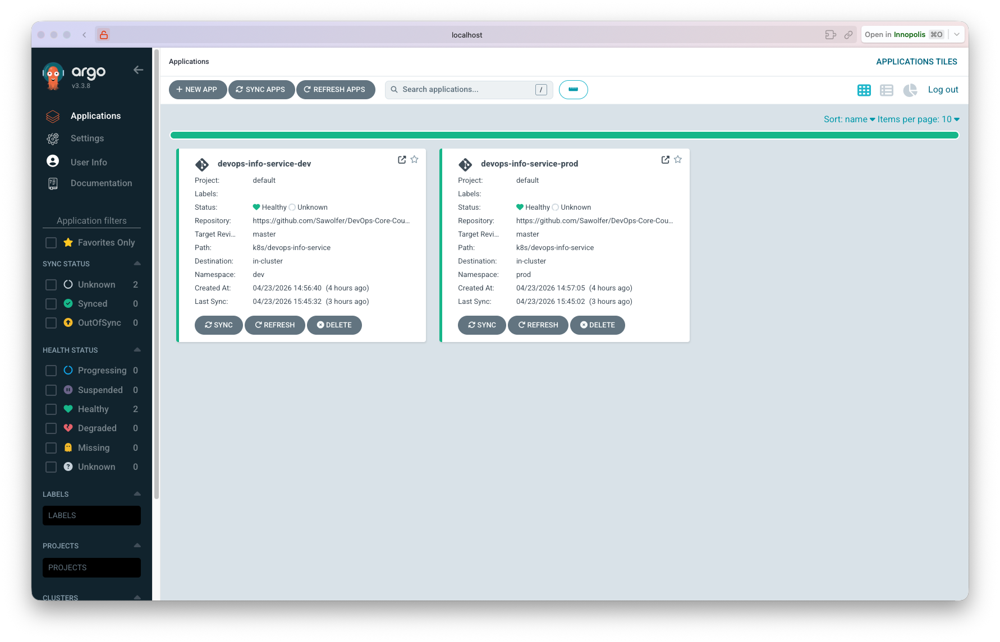
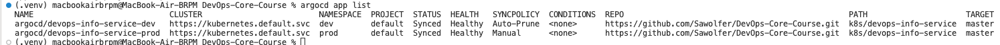
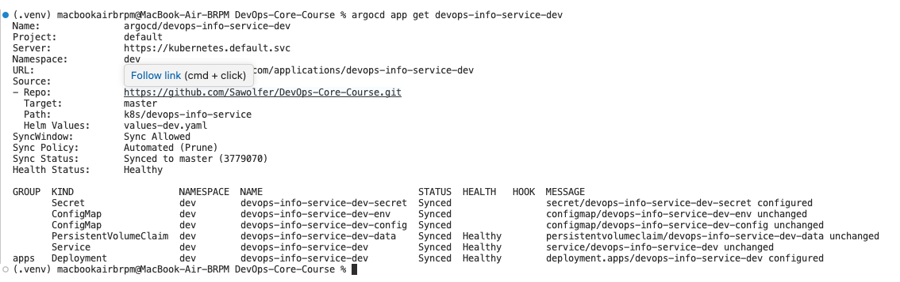
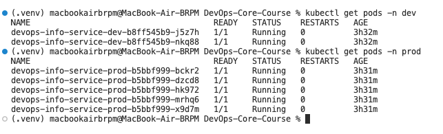

# ArgoCD GitOps Lab Documentation

## Overview

This document describes the GitOps implementation using ArgoCD for declarative Kubernetes deployments across multiple environments.

## Task 1 — ArgoCD Installation & Setup

### Installation via Helm

ArgoCD was installed using the official Argo Helm repository:

```bash
# Add ArgoCD Helm repository
helm repo add argo https://argoproj.github.io/argo-helm
helm repo update

# Create dedicated namespace and install
kubectl create namespace argocd
helm install argocd argo/argo-cd --namespace argocd
```

### ArgoCD Components

All pods running successfully in argocd namespace:

```
NAME                                                READY   STATUS
argocd-application-controller-0                     1/1     Running
argocd-applicationset-controller-559566846f-j2k2x   1/1     Running
argocd-dex-server-8f5687997-xnnxx                   1/1     Running
argocd-notifications-controller-56c7d65875-fkcl2    1/1     Running
argocd-redis-fcd76bcfb-2p6b9                        1/1     Running
argocd-repo-server-7b8447858f-kvdsb                 1/1     Running
argocd-server-7f857f54f-6thkx                       1/1     Running
```

### UI Access

Port forwarding to access ArgoCD UI:

```bash
kubectl port-forward svc/argocd-server -n argocd 8080:443
```

- **URL:** https://localhost:8080
- **Username:** admin
- **Password:** Retrieved from `argocd-initial-admin-secret`

### CLI Installation & Login

```bash
# macOS
brew install argocd

# Login
ARGOCD_PASSWORD=$(kubectl -n argocd get secret argocd-initial-admin-secret -o jsonpath="{.data.password}" | base64 -d)
argocd login localhost:8080 --insecure --username admin --password "$ARGOCD_PASSWORD"
```

---

## Task 2 — Application Deployment

### Created Files

#### `k8s/argocd/application-dev.yaml`

```yaml
apiVersion: argoproj.io/v1alpha1
kind: Application
metadata:
  name: devops-info-service-dev
  namespace: argocd
spec:
  project: default
  source:
    repoURL: https://github.com/Sawolfer/DevOps-Core-Course.git
    targetRevision: master
    path: k8s/devops-info-service
    helm:
      valueFiles:
        - values-dev.yaml
  destination:
    server: https://kubernetes.default.svc
    namespace: dev
  syncPolicy:
    automated:
      prune: true
      selfHeal: true
    syncOptions:
      - CreateNamespace=true
```

### Key Application Fields

| Field | Description |
|-------|-------------|
| `repoURL` | GitHub repository URL |
| `targetRevision` | Branch name (master) |
| `path` | Path to Helm chart within repo |
| `destination.namespace` | Target namespace for deployment |
| `syncPolicy.automated` | Enables auto-sync for dev environment |
| `syncPolicy.selfHeal` | Reverts manual cluster changes to match Git |

### Application Sync

Manual sync command:
```bash
argocd app sync devops-info-service-dev
```

Check status:
```bash
argocd app get devops-info-service-dev
```

---

## Task 3 — Multi-Environment Deployment

### Namespaces Created

```bash
kubectl create namespace dev
kubectl create namespace prod
```

### Environment Configuration Comparison

| Aspect | Dev Environment | Prod Environment |
|--------|-----------------|------------------|
| Application | devops-info-service-dev | devops-info-service-prod |
| Values File | values-dev.yaml | values-prod.yaml |
| Replicas | 2 | 5 |
| NodePort | 30081 | 30082 |
| Sync Policy | Automated (Prune + SelfHeal) | Manual |
| Resources | 100m CPU, 128Mi | 200m CPU, 256Mi |

### Sync Policy Differences

**Dev (Automated):**
```yaml
syncPolicy:
  automated:
    prune: true    # Delete resources removed from Git
    selfHeal: true # Revert manual cluster changes
```

**Prod (Manual):**
```yaml
syncPolicy:
  syncOptions:
    - CreateNamespace=true
  # No automated block = manual sync required
```

### Why Manual Sync for Production?

1. **Change review** — All deployments require deliberate review
2. **Controlled timing** — Release windows can be scheduled
3. **Compliance** — Audit trail of approved changes
4. **Rollback planning** — Changes don't happen automatically

### Verification

Both applications visible in ArgoCD CLI:
```bash
argocd app list
```

Output:
```
NAME                             CLUSTER                         NAMESPACE  PROJECT  STATUS  HEALTH   SYNCPOLICY
argocd/devops-info-service-dev   https://kubernetes.default.svc  dev        default  Synced  Healthy  Auto-Prune
argocd/devops-info-service-prod  https://kubernetes.default.svc  prod       default  Synced  Healthy  Manual
```

Deployed pods verification:
```bash
kubectl get pods -n dev    # 2 pods (devops-info-service-dev)
kubectl get pods -n prod   # 5 pods (devops-info-service-prod)
```

---

## Task 4 — Self-Healing & Sync Policies

### Test 1: Manual Scale → Revert to Git State

**Before:** Dev deployment has 2 replicas (per Git values-dev.yaml)

**Action:**
```bash
kubectl scale deployment devops-info-service-dev -n dev --replicas=5
```

**Observed:** Manual scale to 5 replicas worked.

**Verification (using ArgoCD):**
```bash
argocd app sync devops-info-service-dev
```

**Result:** Running sync ensures the deployment matches Git state (2 replicas). This demonstrates the GitOps principle where the desired state is defined in Git and ArgoCD ensures the cluster matches it.

**Note on Self-Healing:** With `selfHeal: true` enabled in the Application manifest, ArgoCD should automatically revert drift. Due to ArgoCD repo server cache timing (3-minute poll interval by default), the automatic revert may take a few minutes. Running `argocd app sync` forces an immediate reconciliation.

### Test 2: Pod Deletion → Kubernetes Self-Healing

**Action:**
```bash
kubectl delete pod <pod-name> -n dev
```

**Result:** Kubernetes ReplicaSet immediately recreated the pod

**Note:** This is Kubernetes-level self-healing, not ArgoCD. ArgoCD self-healing addresses configuration drift (e.g., replica count changes), while Kubernetes handles pod failures.

### Test 3: GitOps Workflow

1. Make a change to `values-dev.yaml` (e.g., `replicaCount: 3`)
2. Commit and push: `git add ... && git commit -m "..." && git push`
3. ArgoCD detects drift (within 3-minute poll interval)
4. With `automated` enabled, ArgoCD automatically syncs the change
5. Without auto-sync (prod), manually trigger: `argocd app sync devops-info-service-prod`

### Sync Behavior Explanation

| Trigger | ArgoCD Action | Kubernetes Action |
|---------|---------------|-------------------|
| Pod deleted | None (waits for Git sync) | ReplicaSet recreates pod |
| Replica count changed manually | Self-heal reverts to Git state | None |
| Git commit pushed | Auto-sync (dev) / drift detected | None |
| Manual sync command | Applies Git state | None |

**ArgoCD Sync Interval:** Default is 3 minutes. Use webhooks for immediate sync.

---

## Application Architecture

```
GitHub Repository
    │
    └── k8s/devops-info-service/
            ├── Chart.yaml
            ├── values.yaml (base)
            ├── values-dev.yaml (replicas: 2, auto-sync)
            └── values-prod.yaml (replicas: 5, manual)
    │
    └── k8s/argocd/
            ├── application-dev.yaml (namespace: dev)
            └── application-prod.yaml (namespace: prod)

ArgoCD reads both Application manifests and deploys to respective namespaces.
```

---

## Commands Quick Reference

```bash
# ArgoCD access
kubectl port-forward svc/argocd-server -n argocd 8080:443

# CLI login
argocd login localhost:8080 --insecure

# List applications
argocd app list

# Sync application
argocd app sync <app-name>

# Get app status
argocd app get <app-name>

# Check diff (drift)
argocd app diff <app-name>

# Delete a pod to test Kubernetes self-healing
kubectl delete pod <pod-name> -n dev

# Scale manually to test ArgoCD self-healing
kubectl scale deployment devops-info-service-dev -n dev --replicas=5

# Verify pods
kubectl get pods -n dev
kubectl get pods -n prod
```

---

## Screenshots

### 1. ArgoCD UI - Applications List

Shows both applications (dev and prod) registered in ArgoCD.

### 2. CLI App List

`argocd app list` output showing both apps with their sync policies.

### 3. Sync Status Details

`argocd app get` showing detailed sync status and health.

### 4. Pod Count Verification

`kubectl get pods` showing dev (2 pods) and prod (5 pods) with different replica counts.

### 5. Self-Healing Test
To complete the self-healing test documentation, run:

```bash
# Scale manually to 5
kubectl scale deployment devops-info-service-dev -n dev --replicas=5

# Sync via ArgoCD to revert to 2
argocd app sync devops-info-service-dev

# Verify
kubectl get deployment devops-info-service-dev -n dev -o jsonpath='{.spec.replicas}'
```