# Kubernetes Monitoring & Init Containers Report

## Lab 16 — Kube-Prometheus Stack + Init Containers

---

## 1. Monitoring Stack Components

### Prometheus Operator
Manages Prometheus, Alertmanager, and related resources as Kubernetes-native custom resources (CRDs). It automates the lifecycle of monitoring components — creating, configuring, and scaling Prometheus instances declaratively. When you create a `ServiceMonitor` or `PrometheusRule` CR, the Operator picks it up and reconfigures the scrapers.

### Prometheus
Time-series database built for metrics collection and alerting. It scrapes HTTP endpoints (like `/metrics`) on configured targets at regular intervals, stores the data locally with a multi-dimensional data model, and provides PromQL — a powerful query language for aggregating and analyzing metrics. It is the central brain of the monitoring stack.

### Alertmanager
Handles alerts sent by Prometheus. It deduplicates, groups, and routes alerts to the right receiver (Slack, email, PagerDuty, webhook, etc.). Supports inhibition rules (suppress one alert if another is firing) and silences (temporarily mute alerts during maintenance).

### Grafana
Visualization and dashboarding platform. Connects to Prometheus as a data source and renders real-time graphs, heatmaps, tables, and gauges. Ships with pre-built Kubernetes dashboards that display cluster health, node metrics, pod resource usage, and more. Supports alerting natively as well.

### kube-state-metrics
Listens to the Kubernetes API server and generates metrics about the state of Kubernetes objects (deployments, pods, nodes, etc.). Unlike node-exporter (infrastructure), kube-state-metrics exposes object-level data like: `kube_deployment_status_replicas_available`, `kube_pod_container_status_restarts_total`, etc. It does not expose its own resource usage.

### node-exporter
Runs as a DaemonSet on every node and exposes hardware and OS-level metrics: CPU, memory, disk I/O, network statistics, filesystem usage. These metrics power the "Node Exporter / Nodes" dashboards in Grafana and form the foundation for cluster capacity planning.

| Component | Runs As | What It Provides |
|-----------|---------|-----------------|
| Prometheus Operator | Deployment | Manages CRDs, scales Prometheus |
| Prometheus | StatefulSet | Scrapes & stores metrics, PromQL |
| Alertmanager | StatefulSet | Alert routing & notification |
| Grafana | Deployment | Dashboards & visualization |
| kube-state-metrics | Deployment | K8s object state metrics |
| node-exporter | DaemonSet | Node hardware/OS metrics |

---

## 2. Installation

### Helm Setup

```bash
helm repo add prometheus-community https://prometheus-community.github.io/helm-charts
helm repo update

helm install monitoring prometheus-community/kube-prometheus-stack \
  --namespace monitoring \
  --create-namespace
```

### Verify Installation

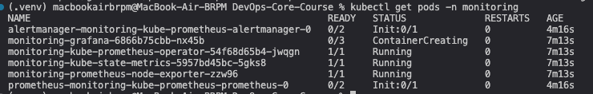

The screenshot shows all pods and services in the `monitoring` namespace running successfully after Helm installation. All components — operator, Prometheus, Alertmanager, Grafana, kube-state-metrics, and node-exporter — are in `Running` state.

---

## 3. Grafana Dashboard Exploration

**Access Grafana:**
```bash
kubectl port-forward svc/monitoring-grafana -n monitoring 3000:80
# Open http://localhost:3000 — login admin / <password from secret>
```

### 3.1 Pod Resources — StatefulSet CPU/Memory

**Dashboard:** "Kubernetes / Compute Resources / Pod"

Filtered to show `devops-info-service` StatefulSet pods. The dashboard displays CPU usage (cores) and memory usage (bytes) graphs per pod, along with request/limit thresholds.

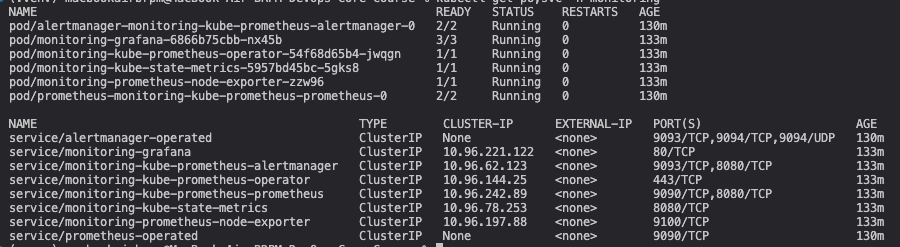

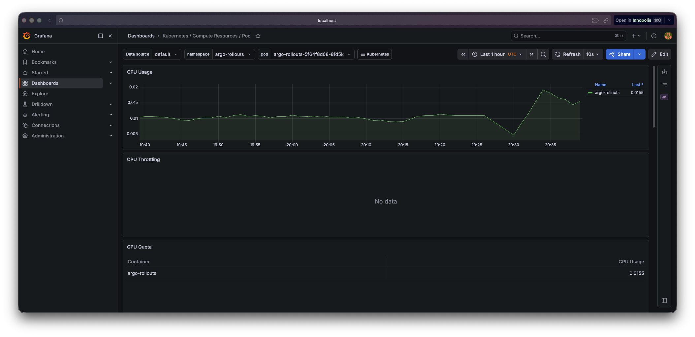

### 3.2 Namespace Analysis — Pod CPU in default Namespace

**Dashboard:** "Kubernetes / Compute Resources / Namespace (Pods)"

Filtered to `default` namespace. Shows CPU and memory usage for each pod sorted by consumption, making it easy to identify resource-heavy workloads.

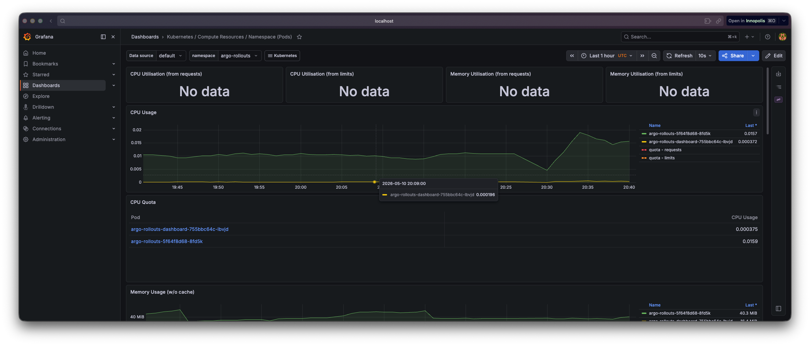

### 3.3 Node Metrics — Memory and CPU

**Dashboard:** "Node Exporter / Nodes"

Displays node-level metrics: memory usage (% and absolute), total CPU cores, load average, disk I/O, and network throughput.

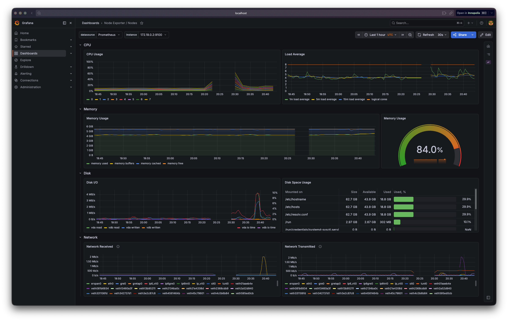

### 3.4 Kubelet — Pods and Containers Managed

**Dashboard:** "Kubernetes / Kubelet"

Shows the number of running pods and containers managed by kubelet, along with operational metrics like pod start latency and container runtime operations.

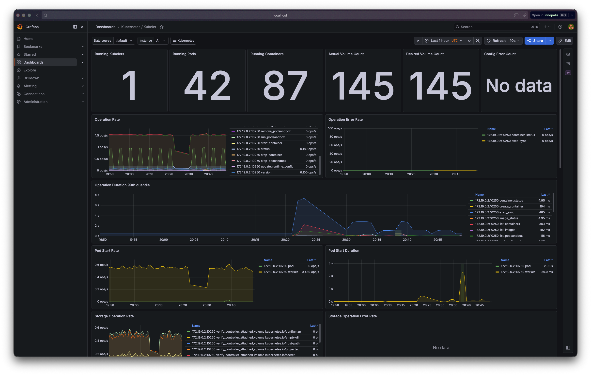

### 3.5 Network — Traffic for Pods in default Namespace

**Dashboard:** "Kubernetes / Networking / Namespace (Pods)"

Filtered to `default` namespace. Displays network receive and transmit rates in bytes per second for each pod.

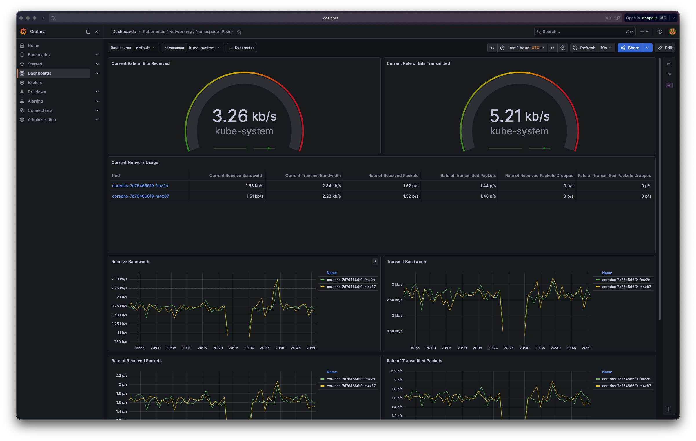

### 3.6 Alerts — Active Alerts in Alertmanager

**Access Alertmanager:**
```bash
kubectl port-forward svc/monitoring-kube-prometheus-alertmanager -n monitoring 9093:9093
# Open http://localhost:9093
```

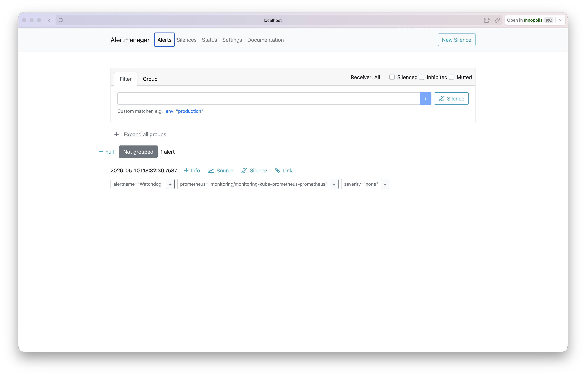

---

## 4. Init Containers

### 4.1 Basic Init Container — File Download

**Objective:** An init container downloads a file using `wget` into a shared `emptyDir` volume. The main container then reads the downloaded file.

**Manifest:** `k8s/init-container-download.yaml`

```yaml
spec:
  initContainers:
    - name: init-download
      image: busybox:1.36
      command: ['sh', '-c', 'wget -q -O /work-dir/index.html https://example.com']
      volumeMounts:
        - name: workdir
          mountPath: /work-dir
  containers:
    - name: main-app
      image: busybox:1.36
      volumeMounts:
        - name: workdir
          mountPath: /data
  volumes:
    - name: workdir
      emptyDir: {}
```

**How it works:**
1. Kubernetes schedules the pod.
2. `init-download` container starts first — downloads `https://example.com` to `/work-dir/index.html` on the shared `emptyDir` volume.
3. After the init container exits successfully (exit code 0), the main container starts.
4. The main container reads `/data/index.html` (the same file, via a different mount path).

**Deploy & Verify:**
```bash
kubectl apply -f k8s/init-container-download.yaml
kubectl get pods -w                    # Watch: Init:0/1 → PodInitializing → Running
kubectl logs init-download-demo -c init-download
kubectl logs init-download-demo        # Main container logs
kubectl exec init-download-demo -- head -5 /data/index.html
```

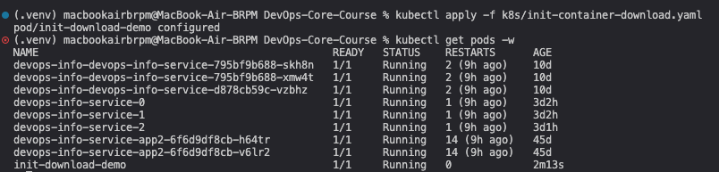

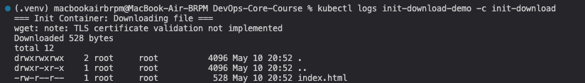

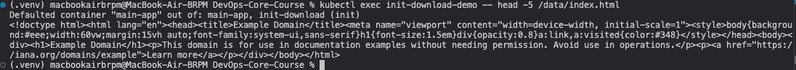

### 4.2 Wait-for-Service Pattern

**Objective:** An init container polls DNS until a dependency service is resolvable. The main container only starts after the dependency is confirmed available.

**Manifest:** `k8s/init-container-wait-service.yaml`

This manifest deploys three resources:
1. **Service** `dependency-service` (ClusterIP) — the dependency to wait for.
2. **Deployment** `dependency-service` — the backend pods serving the dependency.
3. **Pod** `wait-for-service-demo` — the pod with an init container that waits for `dependency-service` DNS to resolve.

```yaml
initContainers:
  - name: wait-for-dependency
    image: busybox:1.36
    command:
      - sh
      - -c
      - |
        until nslookup dependency-service; do
          echo "$(date): dependency-service not ready yet, retrying in 2s..."
          sleep 2
        done
        echo "$(date): dependency-service is ready!"
```

**How it works:**
1. The `dependency-service` Deployment and Service are created first.
2. The `wait-for-service-demo` pod starts its init container.
3. The init container runs `nslookup dependency-service` in a loop every 2 seconds until the service DNS resolves.
4. Once DNS resolution succeeds (i.e., at least one endpoint is ready), the init container exits cleanly.
5. The main container starts, confirming the dependency is available.

**Deploy & Verify:**
```bash
kubectl apply -f k8s/init-container-wait-service.yaml
kubectl get pods -w                    # Watch the wait pod: Init → Running
kubectl logs wait-for-service-demo -c wait-for-dependency
kubectl logs wait-for-service-demo    # Main container: confirms connectivity
```

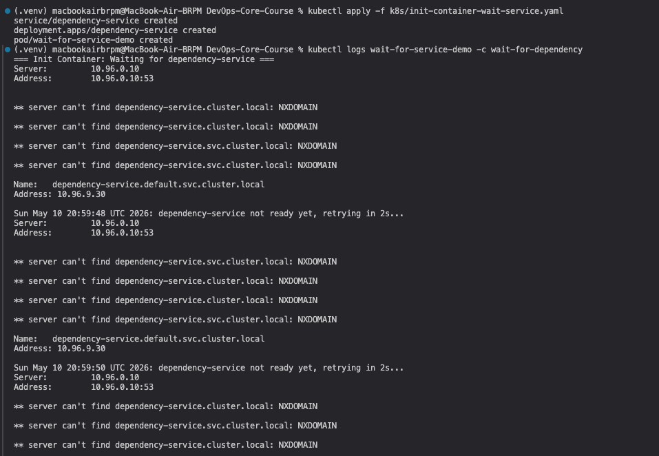

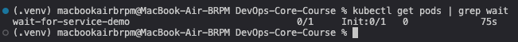

### Init Container Lifecycle

| Phase | Description |
|-------|-------------|
| **Pending** | Pod scheduled, init containers start in order |
| **Init:N/M** | N init containers completed out of M total |
| **PodInitializing** | All init containers done, main containers starting |
| **Running** | All containers running |

**Key Properties:**
- Init containers run **sequentially** in definition order.
- Each init container must complete successfully (exit 0) before the next starts.
- If any init container fails, Kubernetes restarts it (subject to `restartPolicy`).
- Init containers have their **own** resource requests/limits separate from the main container.
- They can use **different images** than the main container (e.g., `busybox` for setup, `python:3.13` for the app).
- They can access **Secrets and ConfigMaps** that the main container cannot, since they run before the main app.

---

## 5. Bonus — Custom Metrics & ServiceMonitor

### 5.1 Application Metrics Endpoint

The `devops-info-service` Python/FastAPI application already exposes a `/metrics` endpoint using the `prometheus_client` library (version 0.23.1).

**Available metrics (from `app_python/app.py`):**

| Metric | Type | Description |
|--------|------|-------------|
| `http_requests_total` | Counter | Total HTTP requests, labeled by method/endpoint/status_code |
| `http_request_duration_seconds` | Histogram | Request duration, labeled by method/endpoint/status_code |
| `http_active_requests` | Gauge | Active in-flight requests |
| `devops_info_endpoint_calls_total` | Counter | Calls per endpoint (/, /health, /visits) |
| `devops_info_system_collection_seconds` | Histogram | Time to collect system info |
| `devops_info_uptime_seconds` | Gauge | Service uptime in seconds |

**Verify locally:**
```bash
kubectl port-forward svc/devops-info-service 8000:80
curl http://localhost:8000/metrics
```

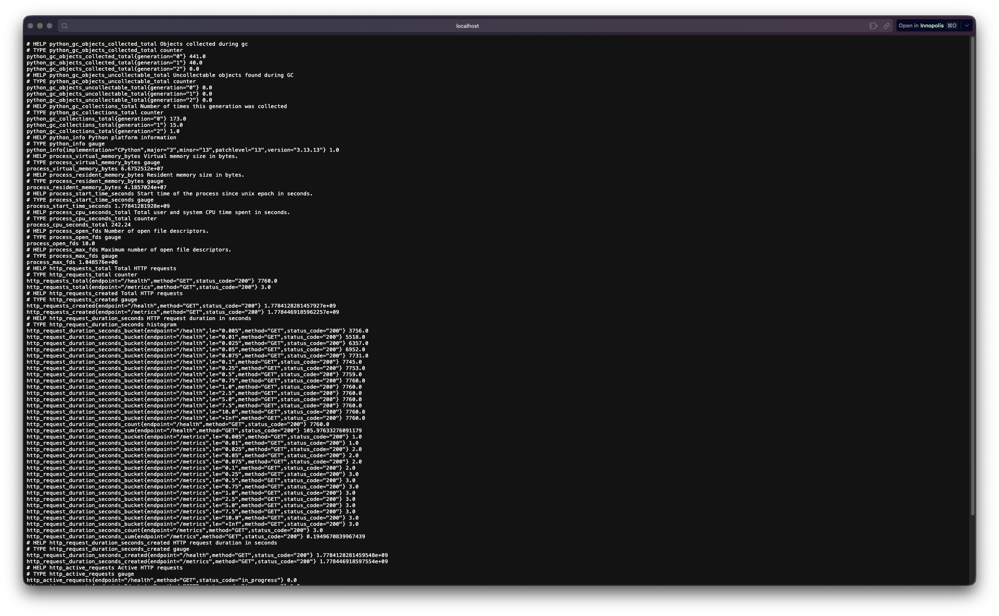

### 5.2 ServiceMonitor CRD

The ServiceMonitor tells Prometheus **which services to scrape, on which ports, and at what path**. The label `release: monitoring` links it to the Prometheus instance created by the Helm chart.

**Manifest:** `k8s/servicemonitor.yaml`

```yaml
apiVersion: monitoring.coreos.com/v1
kind: ServiceMonitor
metadata:
  name: devops-info-service-monitor
  namespace: monitoring
  labels:
    release: monitoring
spec:
  selector:
    matchLabels:
      app.kubernetes.io/name: devops-info-service
  namespaceSelector:
    matchNames:
      - default
  endpoints:
    - port: http
      path: /metrics
      interval: 30s
      scrapeTimeout: 10s
```

**Deploy:**
```bash
kubectl apply -f k8s/servicemonitor.yaml
kubectl get servicemonitors -n monitoring
```

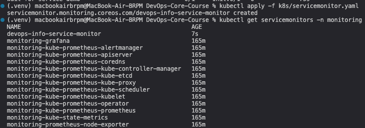

### 5.3 Verify Metrics in Prometheus

```bash
kubectl port-forward svc/monitoring-kube-prometheus-prometheus -n monitoring 9090:9090
# Open http://localhost:9090
```

In the Prometheus UI:
1. Go to **Status → Targets** — verify `devops-info-service-monitor` shows as UP with green state.
2. Go to **Graph** — query `http_requests_total` to see your app's HTTP request counts.

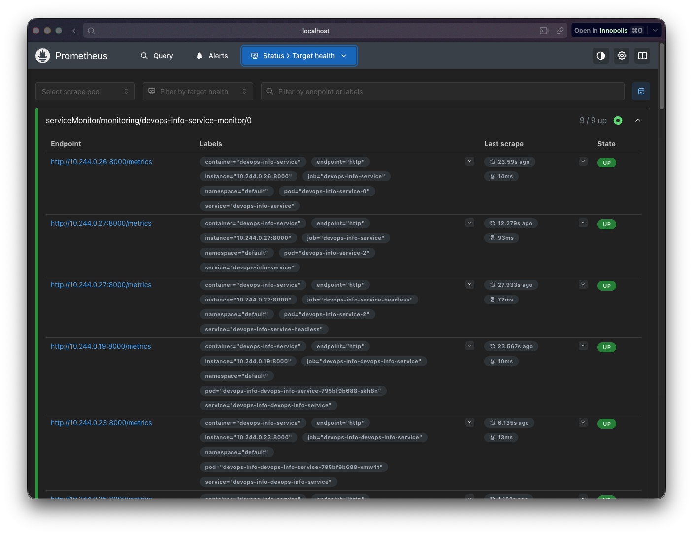

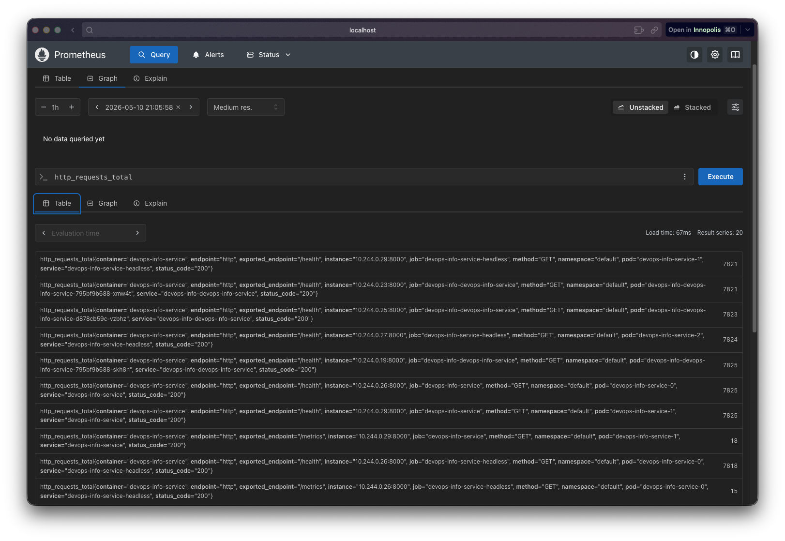

---