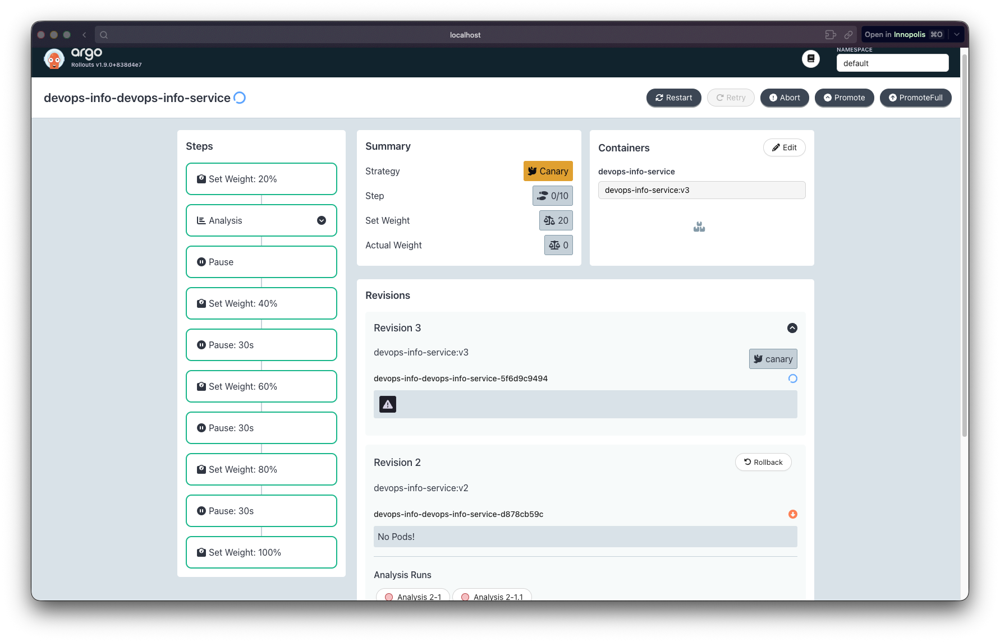
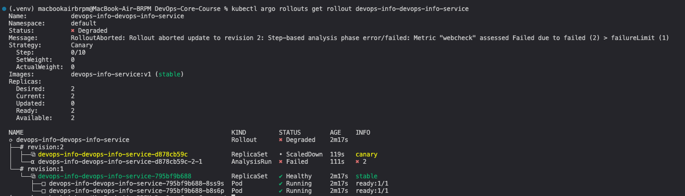
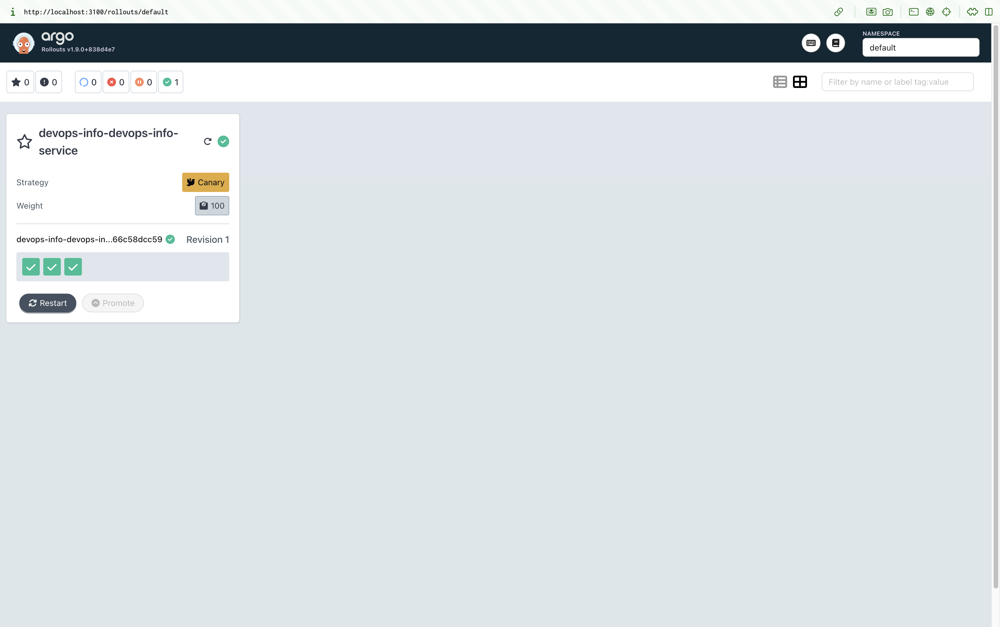
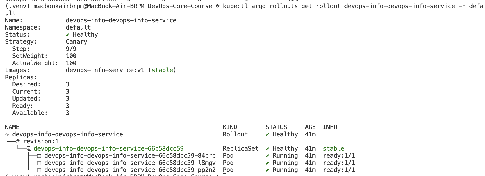
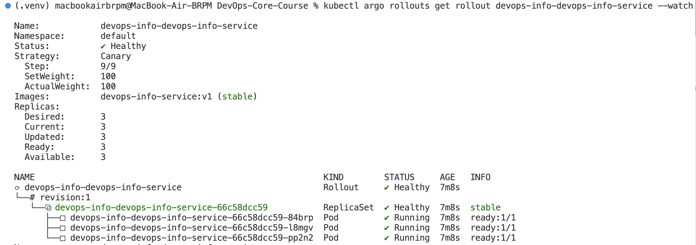
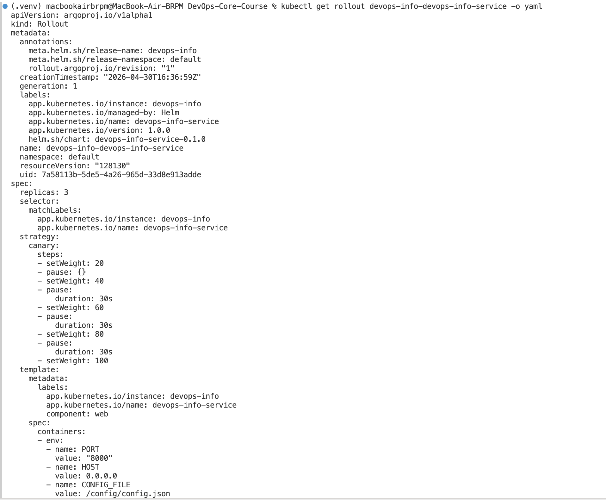
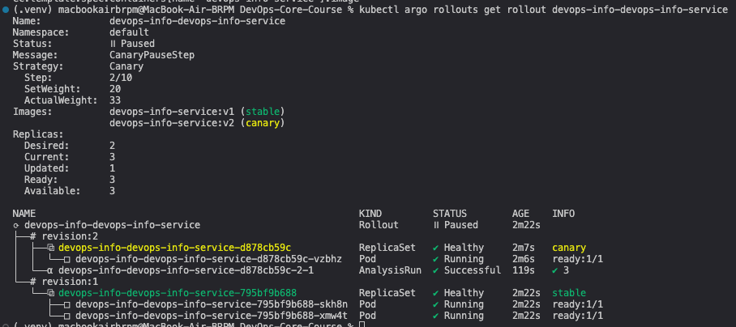

# Lab 14 - Argo Rollouts

## Argo Rollouts Setup

- Controller install (namespace `argo-rollouts`):
  - `kubectl apply -n argo-rollouts -f https://github.com/argoproj/argo-rollouts/releases/latest/download/install.yaml`
- Dashboard install:
  - `kubectl apply -n argo-rollouts -f https://github.com/argoproj/argo-rollouts/releases/latest/download/dashboard-install.yaml`
- Dashboard access:
  - `kubectl port-forward svc/argo-rollouts-dashboard -n argo-rollouts 3100:3100`
  - Open `http://localhost:3100`
- CLI plugin check:
  - `kubectl argo rollouts version`

## Rollout vs Deployment

- Rollout uses `argoproj.io/v1alpha1` and supports `strategy.canary` or `strategy.blueGreen` for progressive delivery.
- Rollout integrates analysis and automated rollback capabilities.
- Rollout keeps the same pod template structure and selectors as a Deployment but adds traffic and promotion control.

## Canary Deployment

### Strategy Configuration

- Template: [k8s/devops-info-service/templates/rollout.yaml](k8s/devops-info-service/templates/rollout.yaml)
- Steps:
  - 20% -> analysis (optional) -> manual pause
  - 40% -> pause 30s
  - 60% -> pause 30s
  - 80% -> pause 30s
  - 100%

### Rollout Progression

- Install (example):
  - `helm upgrade --install devops-info k8s/devops-info-service -f k8s/devops-info-service/values.yaml`
- Watch:
  - `kubectl argo rollouts get rollout devops-info-devops-info-service -w`
- Promote the first pause:
  - `kubectl argo rollouts promote devops-info-devops-info-service`
- Abort to test rollback:
  - `kubectl argo rollouts abort devops-info-devops-info-service`

### Dashboard Evidence

- Screenshot: canary steps view 
- Screenshot: abort and rollback 

### Rollout Evidence

#### Rollout Status in Dashboard

#### Rollout Status

#### CLI Output of Rollout Status

#### YAML Output of Rollout Resource

## Blue-Green Deployment

### Strategy Configuration

- Values override: [k8s/devops-info-service/values-bluegreen.yaml](k8s/devops-info-service/values-bluegreen.yaml)
- Preview service: [k8s/devops-info-service/templates/service-preview.yaml](k8s/devops-info-service/templates/service-preview.yaml)
- Promotion is manual (`autoPromotionEnabled: false`).

### Preview vs Active

- Active service (production):
  - `kubectl port-forward svc/devops-info-devops-info-service 8080:80`
- Preview service (new version):
  - `kubectl port-forward svc/devops-info-devops-info-service-preview 8081:80`
- Promote:
  - `kubectl argo rollouts promote devops-info-devops-info-service`

### Blue-Green Notes

- Blue-green switches all traffic at once by swapping the active service selector.
- Rollback is instant by switching traffic back to the previous ReplicaSet.

## Strategy Comparison

- Canary
  - Pros: gradual exposure, smaller blast radius
  - Cons: slower rollout, mixed traffic during rollout
- Blue-green
  - Pros: instant switch, easy rollback
  - Cons: requires double resources during deployment

Recommendation:
- Canary for user-facing services that need gradual validation.
- Blue-green for internal services or when fast, reversible cutover is required.

## CLI Commands Reference

- Status: `kubectl argo rollouts get rollout <name> -w`
- Promote: `kubectl argo rollouts promote <name>`
- Abort: `kubectl argo rollouts abort <name>`
- Retry: `kubectl argo rollouts retry rollout <name>`

## Bonus - Automated Analysis

### AnalysisTemplate

- Template: [k8s/devops-info-service/templates/analysis.yaml](k8s/devops-info-service/templates/analysis.yaml)
- Enabled via values:
  - `rollout.analysis.enabled: true`

### How It Works

- The web check hits the service `GET /health` and expects JSON `{"status":"healthy"}`.
- Three checks run every 10 seconds; one failure triggers analysis failure.
- Failure aborts the rollout and triggers rollback.

### Evidence

- Screenshot: analysis step success 
- Screenshot: analysis failure rollback 
