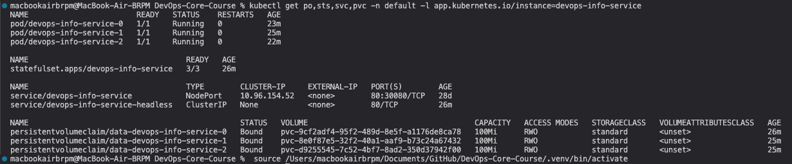
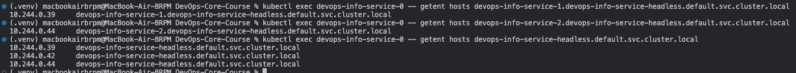
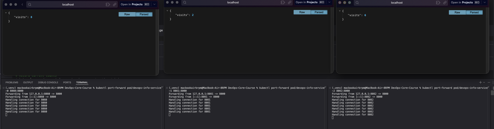
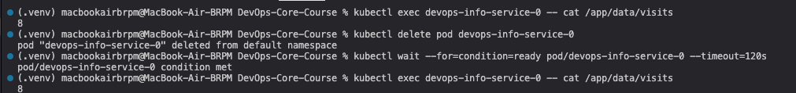
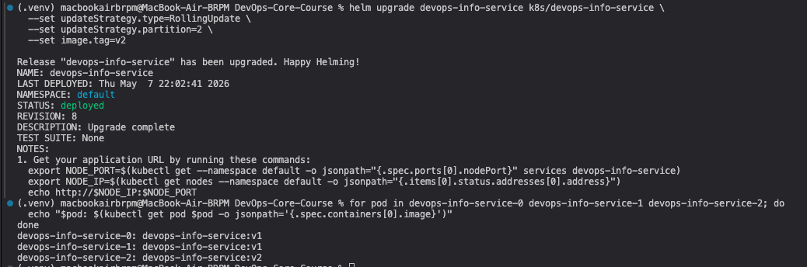
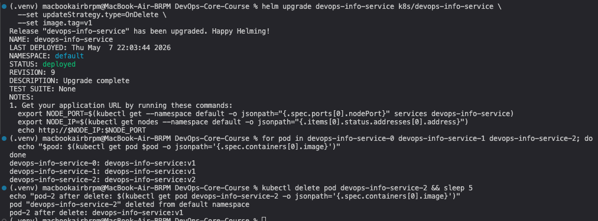

# StatefulSet Implementation Report

## Lab 15 — StatefulSets & Persistent Storage

---

## 1. StatefulSet Overview

### Why StatefulSet?

StatefulSets are Kubernetes workload resources designed for stateful applications that require:

- **Stable, unique network identifiers** — each pod gets a predictable DNS name (e.g., `pod-0.service.namespace.svc.cluster.local`) that persists across rescheduling
- **Stable, persistent storage** — each pod gets its own PersistentVolumeClaim via `volumeClaimTemplates`, ensuring per-instance data isolation
- **Ordered, graceful deployment and scaling** — pods are created/deleted/scaled in strict order (0→1→2, 2→1→0)

### Deployment vs StatefulSet

| Feature | Deployment | StatefulSet |
|---------|------------|-------------|
| **Pod Names** | Random suffix (`app-7d4f5c8b9-xk2m`) | Ordered index (`app-0`, `app-1`, `app-2`) |
| **Storage** | Single shared PVC | Per-pod PVC via `volumeClaimTemplates` |
| **Scaling** | Any order, parallel | Ordered (0→1→2 on scale-up, 2→1→0 on scale-down) |
| **Network Identity** | Random pod IP, ephemeral name | Stable DNS name via headless service |
| **Use Case** | Stateless web servers, API gateways | Databases, message queues, distributed systems |
| **Rolling Updates** | Parallel by default | Sequential, reverse ordinal order |

### Stateful Workload Examples
- Databases: MySQL, PostgreSQL, MongoDB
- Message queues: Kafka, RabbitMQ  
- Distributed systems: Elasticsearch, Cassandra, Zookeeper
- Any app requiring persistent per-instance identity and storage

### Headless Services

A headless service (`clusterIP: None`) creates DNS A records for each pod matching the selector, instead of a single ClusterIP. This enables direct pod-to-pod communication.

**DNS Naming Pattern:**
```
<pod-name>.<headless-service>.<namespace>.svc.cluster.local
```
Example: `devops-info-service-1.devops-info-service-headless.default.svc.cluster.local`

---

## 2. Implementation

### Files Created

#### `templates/statefulset.yaml`
- Uses `kind: StatefulSet` with conditional rendering (`{{ if .Values.useStatefulSet }}`)
- References headless service via `serviceName`
- Configures `volumeClaimTemplates` for per-pod 100Mi PVCs
- Supports `updateStrategy` via values (RollingUpdate, OnDelete, partition)

#### `templates/headless-service.yaml`
- `clusterIP: None` for direct pod DNS resolution
- Conditionally created when `useStatefulSet: true`

#### `templates/deployment.yaml` (modified)
- Wrapped with `{{ if not .Values.useStatefulSet }}` — only created when StatefulSet is disabled

#### `templates/pvc.yaml` (modified)
- Now only creates a single shared PVC when `persistence.enabled AND NOT useStatefulSet`

#### `values.yaml` (modified)
- Added `useStatefulSet: true` toggle
- Added `updateStrategy` block for update configuration

### Chart Structure
```
templates/
├── statefulset.yaml      # NEW: StatefulSet with volumeClaimTemplates
├── headless-service.yaml # NEW: Headless service (clusterIP: None)
├── deployment.yaml       # MODIFIED: Conditional (not useStatefulSet)
├── service.yaml          # Kept for external NodePort access
├── pvc.yaml             # MODIFIED: Conditional (not useStatefulSet)
├── configmap.yaml
├── secrets.yaml
├── _helpers.tpl
└── NOTES.txt
```

---

## 3. Resource Verification

```
$ kubectl get po,sts,svc,pvc -l app.kubernetes.io/instance=devops-info-service

NAME                        READY   STATUS    RESTARTS   AGE
pod/devops-info-service-0   1/1     Running   0          40s
pod/devops-info-service-1   1/1     Running   0          29s
pod/devops-info-service-2   1/1     Running   0          17s

NAME                                   READY   AGE
statefulset.apps/devops-info-service   3/3     40s

NAME                                   TYPE        CLUSTER-IP     PORT(S)        AGE
service/devops-info-service            NodePort    10.96.154.52   80:30080/TCP   28d
service/devops-info-service-headless   ClusterIP   None           80/TCP         40s

NAME                                             STATUS   VOLUME   CAPACITY   ACCESS MODES   STORAGECLASS   AGE
persistentvolumeclaim/data-devops-info-service-0 Bound   pvc-...   100Mi      RWO            standard       40s
persistentvolumeclaim/data-devops-info-service-1 Bound   pvc-...   100Mi      RWO            standard       29s
persistentvolumeclaim/data-devops-info-service-2 Bound   pvc-...   100Mi      RWO            standard       17s
```

**Key Observations:**
- Pods named with ordinal suffixes (-0, -1, -2) — ordered, predictable names
- Each pod has its own independent PVC (`data-devops-info-service-0`, `-1`, `-2`)
- Headless service has `CLUSTER-IP: None`
- NodePort service preserved for external access



---

## 4. Network Identity (DNS Resolution)

### Testing from `devops-info-service-0`:

```bash
$ kubectl exec devops-info-service-0 -- getent hosts devops-info-service-1.devops-info-service-headless.default.svc.cluster.local
10.244.0.39     devops-info-service-1.devops-info-service-headless.default.svc.cluster.local

$ kubectl exec devops-info-service-0 -- getent hosts devops-info-service-2.devops-info-service-headless.default.svc.cluster.local
10.244.0.41     devops-info-service-2.devops-info-service-headless.default.svc.cluster.local
```

### Headless Service Resolution (all pod IPs):

```bash
$ kubectl exec devops-info-service-0 -- getent hosts devops-info-service-headless.default.svc.cluster.local
10.244.0.39     devops-info-service-headless.default.svc.cluster.local
10.244.0.37     devops-info-service-headless.default.svc.cluster.local
10.244.0.41     devops-info-service-headless.default.svc.cluster.local
```

### Self Resolution:

```bash
$ kubectl exec devops-info-service-0 -- getent hosts devops-info-service-0.devops-info-service-headless.default.svc.cluster.local
10.244.0.37     devops-info-service-0.devops-info-service-headless.default.svc.cluster.local
```

**Confirmed:** Each pod can be individually resolved via its stable DNS name through the headless service. The DNS naming pattern is:
```
<pod-name>.<headless-service>.<namespace>.svc.cluster.local
```



---

## 5. Per-Pod Storage Isolation

### Test: Generate different visit counts per pod

**Load generation:**
- pod-0: 3 requests
- pod-1: 1 request
- pod-2: 5 requests

**Results:**

| Pod | Visit Count | Source |
|-----|-------------|--------|
| `devops-info-service-0` | 6 | `cat /app/data/visits` |
| `devops-info-service-1` | 2 | `cat /app/data/visits` |
| `devops-info-service-2` | 6 | `cat /app/data/visits` |

```bash
$ curl -s http://localhost:8080/visits  # pod-0
{"visits":6}

$ curl -s http://localhost:8081/visits  # pod-1
{"visits":2}

$ curl -s http://localhost:8082/visits  # pod-2
{"visits":6}
```

**Confirmed:** Each pod maintains its own isolated visit counter. Different counts across pods prove that storage is per-pod, not shared. The `volumeClaimTemplates` mechanism creates independent PVCs for each StatefulSet instance.



---

## 6. Persistence Test

### Test: Data survives pod deletion

```bash
# Record current counts
$ kubectl exec devops-info-service-0 -- cat /app/data/visits
6

# Delete pod-0
$ kubectl delete pod devops-info-service-0
pod "devops-info-service-0" deleted

# Wait for restart
$ kubectl wait --for=condition=ready pod/devops-info-service-0 --timeout=120s
pod/devops-info-service-0 condition met

# Verify data survived
$ kubectl exec devops-info-service-0 -- cat /app/data/visits
6
```

**PVC remains bound after pod deletion:**
```
NAME                         STATUS   VOLUME   CAPACITY   STORAGECLASS   AGE
data-devops-info-service-0   Bound    pvc-...   100Mi      standard       2m43s
```

**Confirmed:** The visit count (6) is preserved after pod deletion and restart. The PVC outlives the pod — data persists because:
1. `volumeClaimTemplates` creates PVCs that are NOT owned by the pod
2. When pod-0 is deleted, the StatefulSet controller recreates it
3. The new pod reattaches to the same PVC, recovering all data



---

## 7. Bonus: Update Strategies

### 7.1 Partitioned Rolling Update

**Setup:** `updateStrategy.type: RollingUpdate` with `partition: 2`

Only pods with ordinal >= partition value are updated.

```bash
$ helm upgrade devops-info-service k8s/devops-info-service \
    --set updateStrategy.type=RollingUpdate \
    --set updateStrategy.partition=2 \
    --set image.tag=v2
```

**Results:**

| Pod | Image | Updated? | Reason |
|-----|-------|----------|--------|
| devops-info-service-0 | `devops-info-service:v1` | No | ordinal 0 < partition 2 |
| devops-info-service-1 | `devops-info-service:v1` | No | ordinal 1 < partition 2 |
| devops-info-service-2 | `devops-info-service:v2` | **Yes** | ordinal 2 >= partition 2 |

**Confirmed:** Partitioned rolling update allows canary-style deployments — update a subset of pods first, verify, then lower the partition to roll out to the rest.

**Use cases:**
- Canary testing a new version on a subset of pods
- Controlled rollouts in stateful distributed systems
- Zero-downtime upgrades of database clusters (update replicas before leader)

### 7.2 OnDelete Strategy

**Setup:** `updateStrategy.type: OnDelete`

Pods are NOT automatically updated when the StatefulSet spec changes. Updates require manual pod deletion.

```bash
$ helm upgrade devops-info-service k8s/devops-info-service \
    --set updateStrategy.type=OnDelete \
    --set image.tag=v1
```

**Before manual deletion:**
```
devops-info-service-0: devops-info-service:v1
devops-info-service-1: devops-info-service:v1
devops-info-service-2: devops-info-service:v2  ← still old image!
```

**After deleting pod-2:**
```
devops-info-service-2: devops-info-service:v1  ← picked up new spec
```

**Confirmed:** With OnDelete, pod specs only change when the pod is manually deleted. All existing pods keep their current configuration.

**Use cases:**
- Databases requiring manual failover and verification before upgrading
- Applications needing operator-driven upgrade workflows
- Clusters where upgrades must be coordinated with external tooling





---

## 8. Helm Values Reference (StatefulSet mode)

```yaml
useStatefulSet: true   # Enable StatefulSet (disables Deployment + shared PVC)

updateStrategy:
  type: RollingUpdate   # RollingUpdate or OnDelete
  # partition: 2        # Uncomment for partitioned updates

persistence:
  enabled: true
  size: 100Mi           # Per-pod PVC size (via volumeClaimTemplates)
  storageClass: ""      # Default StorageClass
  mountPath: /app/data
  visitsFileName: visits
```
