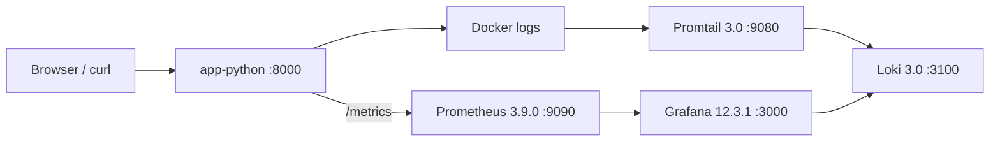

# Lab 8 — Metrics & Monitoring with Prometheus

**Name:** Savva Ponomarev

---

## Architecture



**Metric flow:** application exposes `/metrics` → Prometheus scrapes every 15s → Grafana queries Prometheus with PromQL.

---

## Project Structure

```text
monitoring/
├── docker-compose.yml
├── prometheus/
│   └── prometheus.yml
├── grafana/
│   ├── dashboards/
│   │   ├── lab07-logs-dashboard.json
│   │   └── lab08-metrics-dashboard.json
│   └── provisioning/
│       ├── dashboards/
│       │   └── dashboards.yml
│       └── datasources/
│           └── datasource.yml
└── docs/
    ├── LAB07.md
    └── LAB08.md
```

---

## Application Instrumentation

### Metrics vs Logs (Lab 7)

- **Metrics** answer “how many / how often / how long” (rates, latency distributions, error percentage). They are cheap to aggregate and perfect for dashboards and alerting.
- **Logs** answer “what exactly happened” (request context, error messages, stack traces). They are better for debugging individual incidents.

In this lab the stack is intentionally combined:
- **Prometheus + Grafana** for RED method and fast time-series analytics.
- **Loki + Grafana** (Lab 7) for drill-down and troubleshooting when metrics show anomalies.

### Exposed endpoint

- **Endpoint:** `GET /metrics`
- **Format:** Prometheus text exposition
- **Implementation:** [app_python/app.py](../../app_python/app.py)

The endpoint is implemented as a direct FastAPI route returning `generate_latest()` output. This avoids redirect behavior and makes scraping reliable.

### HTTP (RED) metrics

These metrics implement the RED method (Rate, Errors, Duration) for request-driven services.

1) **Rate** — request counter

- `http_requests_total{method,endpoint,status_code}` (Counter)

2) **Duration** — latency histogram

- `http_request_duration_seconds{method,endpoint,status_code}` (Histogram)

3) **Active requests** — in-flight gauge

- `http_active_requests{method,endpoint,status_code="in_progress"}` (Gauge)

**Labels chosen:**
- `method`: keeps separate behavior for GET/POST
- `endpoint`: path (`/`, `/health`, `/metrics`)
- `status_code`: response code string (e.g. `"200"`, `"404"`)

Cardinality note: labels intentionally avoid user IDs, IPs, etc.

Why these metrics:
- `http_requests_total` enables **Rate** and **Errors** queries (including per-endpoint and per-status).
- `http_request_duration_seconds` supports percentiles and heatmaps for **Duration**.
- `http_active_requests` provides a simple view of concurrency/backpressure.

### Application-specific metrics

1) **Endpoint usage**
- `devops_info_endpoint_calls_total{endpoint}` (Counter)

2) **System info collection time**
- `devops_info_system_collection_seconds{endpoint}` (Histogram)

3) **Service uptime**
- `devops_info_uptime_seconds` (Gauge)

---

## Prometheus Configuration

### Docker Compose

Prometheus is deployed as `prom/prometheus:v3.9.0` and connected to the existing `logging` network from Lab 7.

Key parts are in [monitoring/docker-compose.yml](../docker-compose.yml):

- Mount config: `./prometheus/prometheus.yml` → `/etc/prometheus/prometheus.yml`
- Data volume: `prometheus-data` → `/prometheus`
- Healthcheck: `/-/healthy`
- Retention: configured via CLI flags
  - `--storage.tsdb.retention.time=15d`
  - `--storage.tsdb.retention.size=10GB`

### Scrape configuration

Prometheus scrape config is in [monitoring/prometheus/prometheus.yml](../prometheus/prometheus.yml):

- `job="prometheus"` → `localhost:9090`
- `job="app"` → `app-python:8000`, `metrics_path: /metrics`
- `job="loki"` → `loki:3100`, `metrics_path: /metrics`
- `job="grafana"` → `grafana:3000`, `metrics_path: /metrics`

Global interval:
- `scrape_interval: 15s`
- `evaluation_interval: 15s`

---

## Grafana Dashboards

### Prometheus data source (provisioned)

Grafana provisions data sources from [monitoring/grafana/provisioning/datasources/datasource.yml](../grafana/provisioning/datasources/datasource.yml):

- Loki (default)
- Prometheus
  - URL: `http://prometheus:9090`
  - UID: `grafana-prometheus`

### Dashboard provisioning

Dashboard provider is configured in [monitoring/grafana/provisioning/dashboards/dashboards.yml](../grafana/provisioning/dashboards/dashboards.yml) to load all dashboard JSON files from `/var/lib/grafana/dashboards`.

The Lab 8 dashboard JSON is: [monitoring/grafana/dashboards/lab08-metrics-dashboard.json](../grafana/dashboards/lab08-metrics-dashboard.json)

### Panels (6+)

Dashboard: **Lab 08 - App Metrics**

1) **Request Rate (req/s) by Endpoint**
```promql
sum by (endpoint) (rate(http_requests_total[5m]))
```

2) **Error Rate (5xx req/s)**
```promql
sum(rate(http_requests_total{status_code=~"5.."}[5m]))
```

3) **Request Duration p95 (seconds)**
```promql
histogram_quantile(0.95, sum by (le, endpoint) (rate(http_request_duration_seconds_bucket[5m])))
```

4) **Request Duration Heatmap**
```promql
sum by (le) (rate(http_request_duration_seconds_bucket[5m]))
```

5) **Active Requests (in progress)**
```promql
sum(http_active_requests{status_code="in_progress"})
```

6) **Status Code Distribution**
```promql
sum by (status_code) (rate(http_requests_total[5m]))
```

7) **App Uptime (Prometheus up)**
```promql
up{job="app"}
```

---

## PromQL Examples (with explanations)

1) **Total request rate**
```promql
sum(rate(http_requests_total[5m]))
```
Shows global throughput (requests/sec).

2) **Per-endpoint request rate**
```promql
sum by (endpoint) (rate(http_requests_total[5m]))
```
Shows which endpoint is most active.

3) **5xx error rate**
```promql
sum(rate(http_requests_total{status_code=~"5.."}[5m]))
```
Shows server-side errors per second.

4) **Error percentage (5xx / all)**
```promql
100 * sum(rate(http_requests_total{status_code=~"5.."}[5m])) / sum(rate(http_requests_total[5m]))
```
Returns % of requests that are 5xx.

5) **p95 latency per endpoint**
```promql
histogram_quantile(0.95, sum by (le, endpoint) (rate(http_request_duration_seconds_bucket[5m])))
```
95th percentile response time.

6) **Business metric: endpoint calls**
```promql
sum by (endpoint) (rate(devops_info_endpoint_calls_total[5m]))
```
Shows “business-level” usage, independent of HTTP status labels.

---

## Production Setup

Changes applied in [monitoring/docker-compose.yml](../docker-compose.yml):

- **Health checks**
  - Prometheus: `/-/healthy`
  - App: `/health`
  - Loki: `/ready`
  - Promtail: process-based check (`pidof promtail`)
  - Grafana: `/api/health`

- **Resource limits (per lab requirements)**
  - Prometheus: `1 CPU`, `1G`
  - Loki: `1 CPU`, `1G`
  - Grafana: `0.5 CPU`, `512M`
  - Apps: `0.5 CPU`, `256M`

- **Data retention**
  - Prometheus: 15d and 10GB via CLI flags

- **Persistent volumes**
  - `prometheus-data`, `loki-data`, `grafana-data`, `promtail-data`

---

## Testing Results

### Deployment

```bash
cd monitoring
docker compose up -d
docker compose ps
```

### Prometheus verification

- Targets page: `http://localhost:9090/targets`
- Example query in UI:
  - `up`
  - `sum(rate(http_requests_total[5m]))`

### Quick CLI checks

```bash
# app metrics
curl -L http://localhost:8000/metrics | head -n 30

# Prometheus API sanity
curl -sG --data-urlencode 'query=up{job="app"}' http://localhost:9090/api/v1/query
curl -sG --data-urlencode 'query=sum(http_requests_total)' http://localhost:9090/api/v1/query
```

### Screenshots (evidence placeholders)

Add screenshots to `monitoring/docs/screenshots/` and reference them here:

- Prometheus targets (all UP): `lab08-prometheus-targets.png`
- PromQL query result: `lab08-promql-up.png`
- `/metrics` output snippet: `lab08-metrics-endpoint.png`
- Grafana dashboard (all panels): `lab08-grafana-dashboard.png`
- `docker compose ps` (all healthy): `lab08-compose-ps.png`

---

## Challenges & Solutions

1) **Prometheus failed to start due to retention config in YAML**
- Symptom: container restarting with YAML unmarshal errors
- Fix: remove unsupported `storage.tsdb.retention_*` keys from config and set retention via Prometheus CLI flags in compose.

2) **Prometheus scrape for app returned 404 / redirect**
- Symptom: target `app` DOWN because `/metrics` redirected or did not exist in old image
- Fix: implement `/metrics` as a direct FastAPI route (200 OK) and rebuild `app-python` container.

3) **Promtail healthcheck failed because image lacks wget/curl**
- Symptom: promtail stuck unhealthy with `/bin/sh: wget: not found`
- Fix: change healthcheck to `pidof promtail`.
